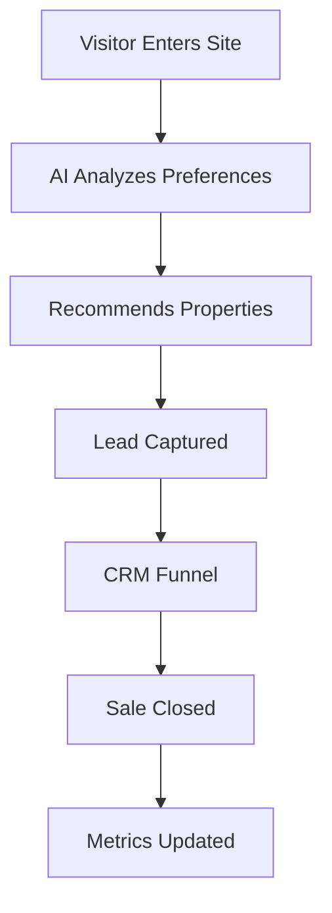

## Overview

Keyspot provides a comprehensive platform for real estate agencies, combining CRM functionality, AI-powered websites, and performance analytics. You can centralize leads, properties, and customer interactions while leveraging intelligent recommendations to convert visitors into clients. This guide covers core features to help you manage operations efficiently.

<Callout kind="info">
Keyspot integrates CRM, site building, and AI in one dashboard at `https://dashboard.example.com`.
</Callout>

## Key Features

Discover the main capabilities through these highlighted features.

<Columns cols={3}>
  <Card title="CRM Lead Management" icon="users" href="#crm-leads">
    Organize leads, track interactions, and automate follow-ups.
  </Card>
  <Card title="AI Website Builder" icon="zap" href="#ai-sites">
    Create intelligent property sites with real-time recommendations.
  </Card>
  <Card title="Performance Analytics" icon="bar-chart-3" href="#analytics">
    Monitor SLA, conversion rates, and key metrics.
  </Card>
</Columns>

## Managing Leads and Sales Funnels

Use Keyspot's CRM to capture, qualify, and nurture leads from your website or other sources.

### Capture and Organize Leads

Follow these steps to set up lead management:

<Steps>
  <Step title="Connect Sources" icon="link">
    Integrate your AI site and external forms to `https://api.example.com/leads`.

````javascript
// Example API call to create a lead
const response = await fetch('https://api.example.com/leads', {
  method: 'POST',
  headers: { 'Authorization': `Bearer ${YOUR_API_KEY}` },
  body: JSON.stringify({
    name: 'João Silva',
    email: 'joao@email.com',
    propertyType: 'apartment',
    budget: 500000
  })
});
````

  </Step>
  <Step title="Assign to Funnels" icon="git-branch">
    Create sales funnels for stages like "New Lead", "Qualified", "Negotiation".

    Customize funnels in the dashboard under CRM > Funnels.
  </Step>
  <Step title="Automate Follow-ups" icon="zap">
    Set email sequences and tasks for each stage.
  </Step>
</Steps>

<Callout kind="tip">
Prioritize leads by AI scoring based on budget and preferences for higher conversions.
</Callout>

## Building AI-Powered Property Websites

Build modern sites that use AI to match properties with visitor preferences.

### Customization Steps

<Tabs>
  <Tab title="Site Setup" icon="globe">
    Start with a template and add your branding.

````jsx
// Dashboard configuration example
const siteConfig = {
  theme: 'modern-real-estate',
  aiEnabled: true,
  filters: ['bedrooms', 'price', 'location'],
  seo: {
    title: 'Keyspot Properties',
    description: 'Find your dream home with AI recommendations'
  }
};
````

  </Tab>
  <Tab title="AI Features" icon="brain">
    Enable vitrine inteligente with advanced filters and recommendations.

    Upload properties via API:

````javascript
await fetch('https://api.example.com/properties', {
  method: 'POST',
  body: JSON.stringify({
    title: '3-Bedroom Apartment',
    price: 450000,
    location: 'São Paulo',
    images: ['img1.jpg', 'img2.jpg']
  })
});
````

  </Tab>
</Tabs>

## Tracking Performance Metrics

Monitor your operations with built-in analytics.

### Key Metrics Dashboard

| Metric          | Description                          | Target          |
|-----------------|--------------------------------------|-----------------|
| SLA Compliance | Time to first response               | `<24h`         |
| Lead Conversion| Leads to sales ratio                 | `>15%`         |
| Site Traffic   | Monthly unique visitors              | `>5000`        |
| AI Matches     | Personalized recommendations served  | `>80%`         |

<Expandable title="Advanced Analytics Setup" default-open="false">

Connect custom events to track deeper insights:

````javascript
// Track conversion event
analytics.track('lead_converted', {
  propertyId: 'prop_123',
  value: 500000,
  source: 'ai_recommendation'
});
````

</Expandable>



<Callout kind="success">
Review weekly reports in `https://dashboard.example.com/analytics` to optimize funnels.
</Callout>

## Next Steps

Explore [Quickstart](/quickstart) for setup or [Authentication](/authentication) for API access. Customize these features to fit your real estate workflow.