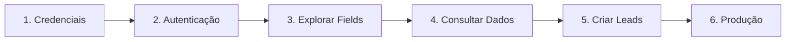
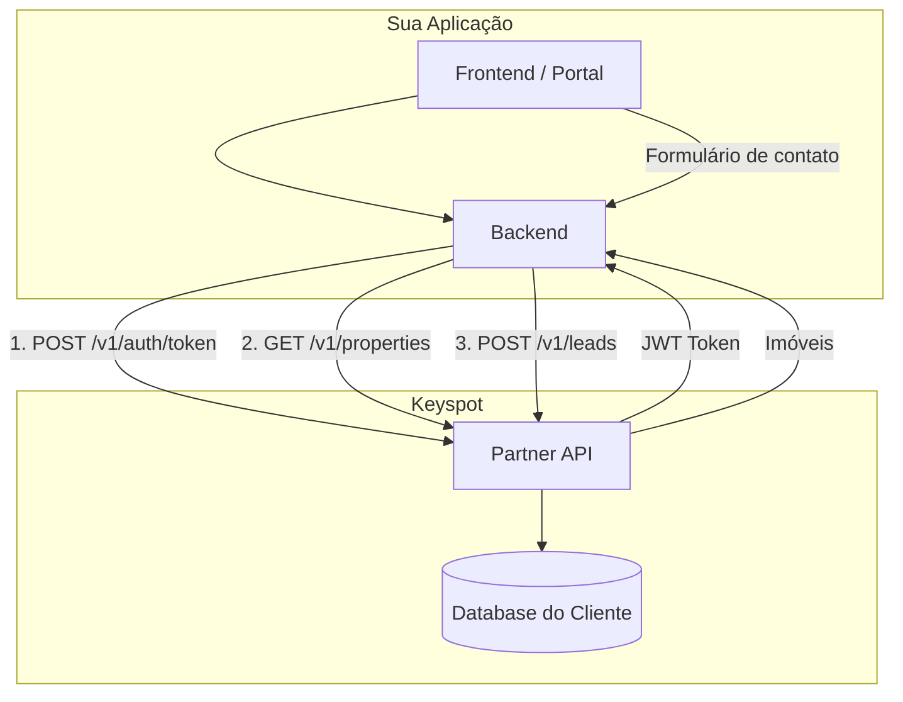

## Visão geral

Este guia descreve o fluxo completo de integração com a Partner API. Cada etapa se baseia na anterior, garantindo que sua integração seja robusta e confiável.

## Etapas da integração

<Steps>
  <Step title="Solicite credenciais" icon="key">
    Entre em contato com a equipe Keyspot para receber seu par `API Key` + `API Secret`. Informe:

    - Nome da empresa parceira
    - Caso de uso da integração (portal, CRM, site, etc.)
    - IPs de origem das requisições (se aplicável)

    Você receberá credenciais com um rate limit configurado de acordo com seu caso de uso.
  </Step>

  <Step title="Implemente a autenticação" icon="lock">
    Implemente o fluxo JWT de duas fases:

    1. `POST /v1/auth/token` com headers `X-API-Key` e `X-API-Secret`
    2. Use o token retornado como `Bearer` nas rotas protegidas
    3. Renove o token antes de expirar (1 hora)

    Veja detalhes em [Autenticação](/comece-aqui/autenticacao).
  </Step>

  <Step title="Descubra os campos disponíveis" icon="list">
    Antes de consumir dados, consulte `GET /v1/fields` para entender a estrutura de cada entidade:

    - **properties**: imóveis com campos como `title`, `address`, `pricing`, `features`, `photos`
    - **leads**: contatos com campos como `name`, `email`, `phone`, `status`, `source`

    Use também `GET /v1/values/{entity}/{field}` para descobrir os valores possíveis de cada filtro.
  </Step>

  <Step title="Consuma dados de imóveis" icon="home">
    Use `GET /v1/properties` com os filtros adequados ao seu caso:

    - **Portal imobiliário**: `fields=code,title,description,address,pricing,features,photos&status=AVAILABLE`
    - **Dashboard analítico**: `fields=code,title,status,operationType,createdAt&limit=100`
    - **Sincronização incremental**: `fields=code,title,status,updatedAt&updatedAfter=2026-03-01T00:00:00Z`

    Implemente paginação para percorrer todos os resultados.
  </Step>

  <Step title="Integre a criação de leads" icon="user-plus">
    Conecte seus formulários ao `POST /v1/leads`. Campos obrigatórios:

    - `name`, `email`, `phone`, `message`

    Campos opcionais que enriquecem o lead:

    - `source`: identifique a origem (WEBSITE, PORTAL_VIVAREAL, GOOGLE_ADS, etc.)
    - `propertyCode`: vincule ao imóvel de interesse
    - `trafficOrigin`: rastreie a campanha ou UTM de origem
  </Step>

  <Step title="Prepare para produção" icon="rocket">
    Antes de ir para produção, revise o [checklist de boas práticas](/guias/boas-praticas):

    - [ ] Tratamento de todos os códigos de erro
    - [ ] Renovação automática de token
    - [ ] Paginação implementada
    - [ ] Rate limiting respeitado
    - [ ] Credenciais armazenadas com segurança
    - [ ] Retry com backoff exponencial
  </Step>
</Steps>

## Diagrama de arquitetura

## Cenários de integração

<Tabs>
  <Tab title="Portal Imobiliário">
    **Objetivo**: exibir imóveis do cliente em um portal externo.

    1. Sincronize o catálogo periodicamente via `GET /v1/properties`
    2. Use `updatedAfter` para sincronização incremental
    3. Capture leads dos formulários do portal via `POST /v1/leads`
    4. Identifique a origem com `source: "PORTAL"` ou o portal específico
  </Tab>
  <Tab title="CRM / Marketing">
    **Objetivo**: importar leads para um CRM ou ferramenta de marketing.

    1. Liste leads recentes com `GET /v1/leads?createdAfter=...`
    2. Use filtros de status para segmentar o funil
    3. Crie leads de campanhas via `POST /v1/leads` com `trafficOrigin`
  </Tab>
  <Tab title="Site Personalizado">
    **Objetivo**: alimentar um site com dados de imóveis.

    1. Consulte imóveis com todos os campos necessários para exibição
    2. Inclua `photos` para exibir as imagens
    3. Use `GET /v1/values/properties/propertyType` para popular filtros do site
    4. Capture leads de formulários de contato
  </Tab>
</Tabs>

## Próximos passos

<Columns cols={2}>
  <Card title="Boas Práticas" icon="check-circle" href="/guias/boas-praticas">
    Paginação, tratamento de erros, retry e checklist de produção.
  </Card>
  <Card title="Dicionário de Dados" icon="database" href="/referencia/dicionario-dados">
    Referência completa de todas as entidades e campos.
  </Card>
</Columns>
